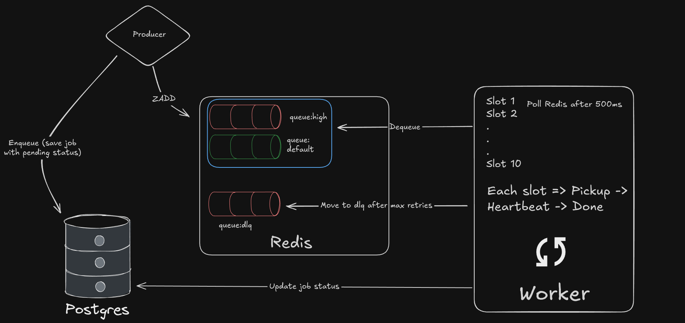

# Distributed Job Queue

A background job processing system built from scratch in NestJS + Redis + PostgreSQL — no BullMQ, no abstractions.



## Why I built this

I wanted to understand how job queues actually work under the hood — what happens when two workers try to pick up the same job, how locks expire, how retries work without losing jobs. So instead of using BullMQ, I built the primitives myself.

## How it works

When you enqueue a job, it gets saved to PostgreSQL and pushed into a Redis sorted set. Workers poll Redis every 500ms and pick up jobs using a Lua script that atomically pops the job and acquires a lock in one operation — so two workers can never process the same job simultaneously.

While a job is running, a heartbeat renews the lock every 10 seconds. If the job takes longer than expected (slow SMS provider, network hang), the lock stays alive. If the worker crashes, the heartbeat stops, the lock expires, and another worker picks up the job.

Failed jobs retry with exponential backoff (2s, 4s, 8s). After max retries they go to a dead letter queue where you can inspect and manually retry them.

## Stack

- **NestJS** — framework
- **Redis** — job queues (sorted sets) + locking
- **PostgreSQL** — job audit log
- **Lua scripts** — atomic Redis operations
- **k6** — load testing

## Running locally

```bash
# start Redis and PostgreSQL
docker-compose up -d

cp .env.example .env

npm install
npm run start:dev
```

## Enqueue a job

```bash
curl -X POST http://localhost:3000/jobs \
  -H "Content-Type: application/json" \
  -d '{
    "type": "SEND_PAYMENT_SMS",
    "priority": "high",
    "payload": {
      "phone": "+91-98XXXXXX02",
      "amount": 5000,
      "txnId": "TXN_001"
    }
  }'
```

## API

| Method | Route | Description |
|---|---|---|
| POST | `/jobs` | Enqueue a job |
| GET | `/jobs/:id` | Check job status |
| GET | `/jobs/dlq/all` | View failed jobs |
| POST | `/jobs/:id/retry` | Manually retry a DLQ job |
| GET | `/dashboard/stats` | Queue depths + job counts |
| GET | `/dashboard/recent` | Last 20 jobs |

## Adding a new job type

Create a handler file in `src/handler/handlers/`, then register it in `HandlerModule`:

```typescript
// src/handler/handlers/send-email.handler.ts
export async function sendEmailHandler(payload: Record<string, any>): Promise<void> {
  // your logic here
}
```

```typescript
// src/handler/handler.module.ts — inside onModuleInit()
this.registry.register('SEND_EMAIL', sendEmailHandler);
```

That's it. Nothing else to change.

## Things I specifically wanted to get right

**Atomic job pickup** — without Lua, there's a gap between popping a job from the queue and setting the lock where another worker can interfere. The Lua script makes both operations happen as one.

**Lock renewal for slow jobs** — a 30s lock TTL doesn't work if your SMS provider takes 90 seconds. The heartbeat renews the lock every 10s so it never expires while the job is still running.

**Zero message loss on crash** — if a worker dies mid-job, the heartbeat stops, the lock expires after 30s, and another worker picks the job up automatically.

**Exponential backoff** — retrying immediately after failure hammers a struggling provider. Waiting 2s, then 4s, then 8s gives it room to recover.

## Environment variables

| Variable | Default | Description |
|---|---|---|
| `WORKER_CONCURRENCY` | `10` | Concurrent poll slots |
| `WORKER_POLL_INTERVAL_MS` | `500` | How often workers poll Redis |
| `LOCK_TTL_SECONDS` | `30` | Redis lock TTL |
| `HEARTBEAT_INTERVAL_MS` | `10000` | Lock renewal interval |
| `MAX_RETRIES` | `3` | Attempts before DLQ |

## Load testing

```bash
# install k6 (Linux)
sudo apt-get install k6

# run the load test
k6 run load-test.js

# monitor worker progress live in another terminal
node monitor.js
```

Processed 587+ jobs/min under 50 concurrent users with zero message loss across 2,838 jobs.